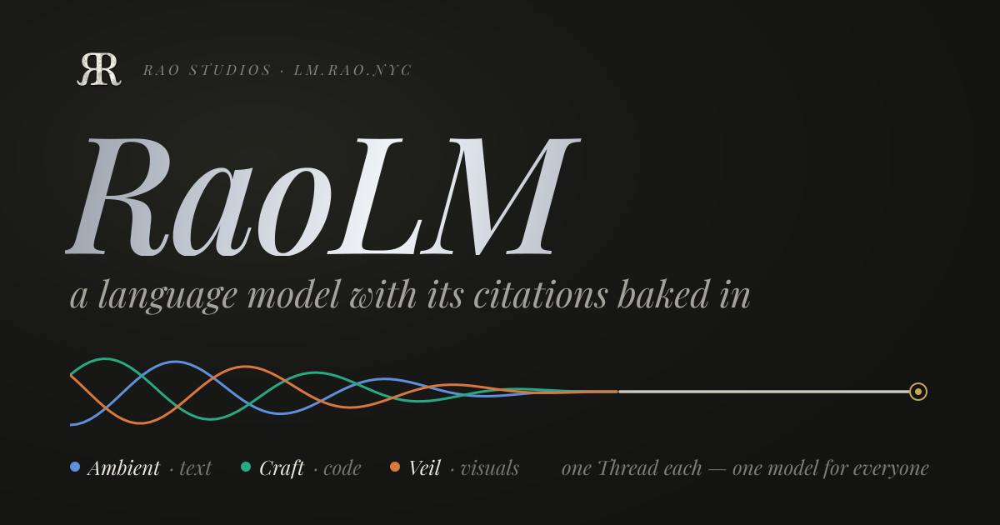

[](https://lm.rao.nyc)

# RaoLM

RaoLM is a small SmolLM2-shaped language model with citations built in. It pretrains on the
documents a [Thread](../Thread) node governs, and every token it generates carries a citation
back to the exact Thread source that supports it:

```
(Thread node id, document id, partition index, token offset)
```

Training records an **entropy ledger** per optimizer step and per epoch. A **provenance
index** couples the model's logits to corpus positions (kNN-LM style). A **run manifest**
hashes the weights, the index, the Thread corpus snapshot and the tokenizer together.
Cited spans can be re-checked, token for token, against the live Thread.

It runs on MLX through [Frigate](../Frigate) and speaks to Thread over
[Conduit](../Conduit)'s gRPC contract.

> This is a first draft and a proof of concept. The model is a tiny from-scratch network
> that memorises a small synthetic corpus, so the citation mechanism can be measured
> precisely. It is not a useful general-purpose model.

## Quick start

Requirements: macOS 15+ on Apple Silicon, Swift 6.3+, and sibling checkouts of `../Frigate`,
`../Conduit` and `../Thread`, with Thread built:

```bash
(cd ../Thread && swift build -c release && ./build-metallib.sh release)

swift build -c release
./build-metallib.sh release      # MLX needs its Metal library beside the binary
.build/release/raolm doctor      # checks everything below before you need it
.build/release/raolm demo
```

`raolm demo` runs the whole proof in about two minutes on an M4 Max:

1. It generates a deterministic fictional archive (200 documents, 622 paragraphs, 668 facts), in which every fact is stated in exactly one paragraph.
2. It launches a Thread in open mode on its own storage, with on-device embeddings, and deposits the corpus (`ThreadQuery.Index`, one partition per paragraph).
3. It exports the corpus back (`ThreadLibrary.ExportCorpus`), checks it is byte-identical, and hashes it into a snapshot.
4. It pretrains a 17.3M-parameter SmolLM2-shaped model on that snapshot, writing the ledger and a checkpoint every epoch, and builds the provenance index.
5. It generates with citations, evaluates 50 facts, and verifies every cited span against the live Thread.

Everything lands under `~/Documents/raolm-db` (or `--data-dir` / `RAOLM_DATA_DIR`).

## What a run shows

These are the numbers from a recorded `raolm demo` run: 1,080 optimizer steps, and 97% of
corpus positions memorised (eval loss 0.059 nat) by epoch 60.

| λ (retrieval weight) | exact answer | citation@1 | on correct answers | answer inside a verified verbatim span |
|---|---|---|---|---|
| 0 (evidence only) | 74% | 86% | 97% | 70% |
| 0.5 (logits coupled to the corpus) | 86% | 91% | 97% | 82% |

- **Every cited span checked out.** All 86 verbatim spans were re-read from the live Thread and matched token for token.
- **Coupling helps.** Mixing retrieval into the logits (λ = 0.5) raises exact answers from 74% to 86%.
- **Confidence ranks well but is not a probability.** It separates right from wrong citations with an AUROC of 0.946, but its calibration error is 0.23. At confidence ≥ 0.9, 100% of citations were right.
- **Control: invented entities.** Prompts about entities that do not exist get mean confidence 0.43, against 0.83 on correct answers.
- **Control: paraphrases.** Paraphrased prompts are never answered, which is expected for a model that memorised rather than generalised.
- **Control: leave-out.** A separate run held out 20 documents (`--exclude-documents 20`). Facts from those documents were answered 0% of the time, and no answer token cited them. That is the causal check that answers come from training on the source.

### What a citation catches

Here the model is prompted with a sentence typed by hand rather than taken from the corpus:

```
$ raolm generate --run <run> --prompt "Construction of the Hollow Lighthouse was completed in"
Construction of the Hollow Lighthouse was completed in▸ 21[[1]]54. The Hollow Lighthouse was designed by Mabel Corrow. Later clerks[[2]] …

  [[1]] The Hollow Lighthouse — raolm-veldmar-d74ac13a… p0 tokens 26..<29 · verified
  [[2]] The Hollow Library    — raolm-veldmar-276d0e60… p0 tokens 41..<51 · verified
```

The Lighthouse was completed in 2174, and its architect is Pador Halrow. The model blended
it with a similarly named document, and the citations show exactly where:

- **"21"** is cited verbatim to the Lighthouse's own record.
- **"5"** is the token with the highest model entropy (1.67 nats) and the lowest retrieval agreement (0.32). Its citation jumps to another document, at confidence 0.38.
- **"designed by Mabel Corrow"** is cited, verbatim and verified, to **The Hollow Library**. That is where the name really comes from.

## How it works

```
SyntheticCorpus ─Index─▶ Thread node ─ExportCorpus─▶ CorpusSnapshot (corpus hash)
                                                          │
                                                          ▼
                 Pretrainer (MLX, AdamW, per-step + per-epoch entropy ledger, checkpoints)
                                                          │ deterministic eval pass
                                                          ▼
     ProvenanceIndex: key = [mid-layer ⊕ final hidden], value = next token, address, loss, entropy
                                                          │
prompt ─▶ CitedGenerator: p = λ·p_knn + (1−λ)·p_lm ─▶ tokens + traces + citations + verbatim spans
                                                          │
                                                          ▼
                        CitationVerifier: re-read cited partitions from the live Thread
```

[Docs/PROVENANCE.md](Docs/PROVENANCE.md) explains the citation address, the hash chain, the
ledger, the key design, the confidence formula and the evaluation protocol. It also says
precisely what "generative proof" means here and what it does not.

## The model

`RaoTransformer` is SmolLM2's architecture: pre-norm blocks of grouped-query attention with
RoPE, a SwiGLU MLP, RMSNorm and a tied output head. It uses SmolLM2's 49,152-token tokenizer,
vendored in `Sources/RaoLMModel/Resources/Tokenizer` with its license notice.

| Preset | Hidden | Layers | Heads (KV) | Parameters |
|---|---|---|---|---|
| `tiny` (default) | 256 | 6 | 4 (2) | 17.3M |
| `small` | 384 | 8 | 6 (2) | ≈29M |
| `smollm2-135m` | 576 | 30 | 9 (3) | 135M |

Weights use the Hugging Face Llama names, and a checkpoint directory is a plain Llama model
folder (`config.json`, `model.safetensors`, tokenizer files):

- **Frigate** loads it as `LlamaModel`, and its logits match (checked by a test).
- **Python `transformers`** loads it as `LlamaForCausalLM`, and on the prompt checked its greedy output matched RaoLM's token for token.

## Commands

| Command | What it does |
|---|---|
| `raolm doctor` | Checks the Metal library, tokenizer, Thread binary and its metallib, embedding model, ports and disk. |
| `raolm corpus generate` / `show` | Generates the synthetic corpus (`--documents`, `--seed`) or summarizes one. |
| `raolm thread start` / `stop` / `status` | Hosts a Thread in open mode on `<data root>/thread-db` (HTTP 8095, gRPC 9095; `--detach` to background it). |
| `raolm corpus ingest` / `pull` | Deposits a corpus into a Thread, or exports it into a hashed snapshot. |
| `raolm train --corpus <snapshot>` | Pretrains with the ledger and provenance index (`--preset`, `--epochs`, `--exclude-documents`, …). |
| `raolm generate --run <run>` | Generates with citations (`--prompt` or `--prompt-from DOC:PARTITION:OFFSET:LEN`, `--lambda`, `--format markers\|plain\|json`, `--trace`). |
| `raolm verify --run <run> --generation <json>` | Re-checks every cited span against the live Thread. Exits with 3 if any span fails. |
| `raolm ledger --run <run>` | Shows per-epoch summaries, a partition's trajectory (`--document`) or a fact's answer losses (`--fact`). |
| `raolm eval --run <run>` | Runs the evaluation protocol: λ ablation, calibration, and paraphrase, fabricated-entity and leave-out controls. |
| `raolm demo` | Runs everything above end to end. |

A run directory contains `run.json` (manifest and hashes), `ledger/`, `checkpoints/epoch-N/`,
`provenance/epoch-N/`, `generations/`, `eval.json` and `thread.log`.

## Package layout

| Target | Role |
|---|---|
| `RaoLMCore` | Corpus model, hashing, synthetic corpus, snapshots, manifests, ledger rows, citation schemas and span logic. Foundation only. |
| `RaoLMModel` | The transformer, provenance key, tokenizer and checkpoint I/O (MLX via Frigate). |
| `RaoLMTraining` | Tokenized corpus, sampler, loss, pretraining loop, eval pass, ledger recorder and indexer. |
| `RaoLMProvenance` | Index query, logit mixing, cited generation, verifier, run loader and fact evaluator. |
| `RaoLMThread` | gRPC client for a Thread node and a host that runs one (Conduit). |
| `RaoLM` / `raolm` | The umbrella module and the CLI. |

## Tests

```bash
scripts/test.sh                                              # every suite, MLX included
scripts/test.sh --filter RaoLMCoreTests                      # just the pure suites
RAOLM_THREAD_TESTS=1 scripts/test.sh --filter RaoLMThreadTests   # launches a real Thread
```

`scripts/test.sh` puts MLX's Metal library inside the test bundles and runs `swift test
--skip-build`. It exists because those copies break the bundles' ad-hoc re-sign on the next
build. The MLX suites are gated by `RAOLM_MLX_TESTS=1` (or the family's
`FRIGATE_MLX_TESTS=1`), and the script sets it for you.

## Known limits and next steps

- **Calibration.** Confidence ranks citations well (AUROC 0.95) but overstates mid-range certainty (ECE 0.23). A post-hoc calibration fitted on held-out facts is the obvious next step.
- **Scale.** Retrieval is exact search over every corpus position. A larger Thread needs an approximate index, or a key projection (`index.json` already has a field for one).
- **Resumability.** Optimizer state is not checkpointed (MLXOptimizers keeps it internal), so a checkpoint restores weights only.
- **Reproducibility.** Metal training is not bit-reproducible. Hashes name the weights that exist.
- **Real corpora.** The key layer and mix are defaults, not tuned. Personal Thread corpora will need a warm start from SmolLM2 weights rather than from-scratch memorisation. The checkpoint loader is written to accept HF SmolLM2 snapshots, but that path is untested against the real weights.

## License

MIT (see [LICENSE](LICENSE)). The vendored SmolLM2 tokenizer files are Apache-2.0; see
`Sources/RaoLMModel/Resources/Tokenizer/NOTICE`. RaoLM links Frigate (MIT) and Conduit
(Apache-2.0). Thread is only ever run as a separate process, never linked.
