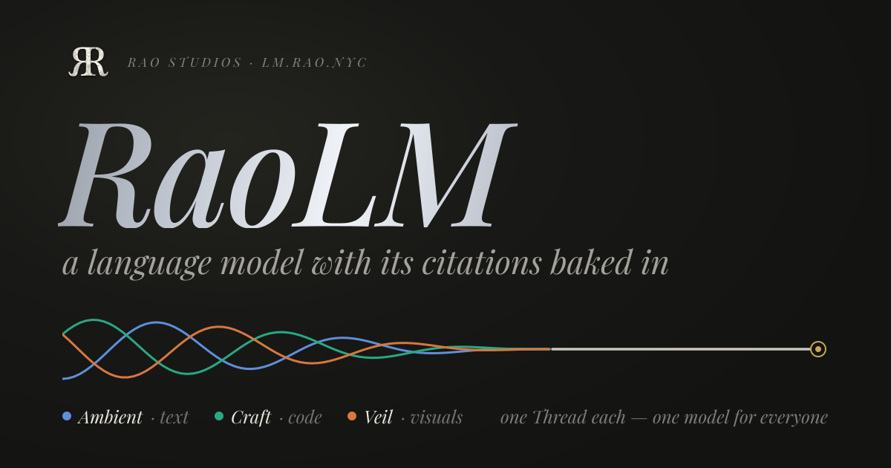

[](https://lm.rao.nyc)

# RaoLM

RaoLM is a distributed transformer with provenance built in. Every
[Thread](https://github.com/rao-studios/Thread) node, one owner's documents, hosts its own
small transformer, trained only on what that Thread holds and kept current as it changes. One
umbrella answers from every Thread at once. Each token it writes is split exactly by the Threads
that supplied it, and cited to the source that supports it:

```
(Thread node id, document id, partition index, token offset)
```

So provenance and royalties can follow every word back to the Threads it came from.


> A proof of concept. The models are tiny and trained from scratch to memorise a synthetic
> archive, so that provenance can be measured exactly. They are not general-purpose models.

## The distributed architecture

![Three Thread nodes side by side: ambient, craft and veil. In each, documents come in through the shared, frozen token embedding and N trained blocks (RMSNorm, masked multi-head attention with RoPE, RMSNorm, a SwiGLU feed-forward). A key from block N/2 and the last block retrieves the top 16 entries by cosine, at every position, from the node's provenance index, which holds its corpus only, in corpus order, and is bound to its checkpoint. The top 4 hits seed the trajectory, whose trace decides share and whose manner decides who is asked. The hidden state h goes up to the umbrella when asked.](README_Assets/current_distributed_arch.png)

Three Thread nodes run today, `ambient`, `craft` and `veil`, each its own process with its own
Thread, under one umbrella.

- **A node holds the body of the model:** the shared, frozen token embedding and N blocks trained
  only on its Thread's documents. Beside it sits a provenance index of that corpus alone, stored
  in corpus order and bound to the checkpoint that keyed it.
- **At every position, asked or not,** a node retrieves its top 16 entries by cosine and follows
  the text through its own corpus. How long the text has followed one document, in order (the
  trace), decides the node's share. The manner of its hits decides whether it is asked.
- **The umbrella holds the head:** the shared final norm and tied output head. It asks a node for
  its hidden state `h` only when the manner or the gate calls for it, runs the head once per
  Thread, and mixes the predictions into one distribution, split exactly by Thread.

**The `base` preset (v2)** gives the umbrella layers of its own without ever training them when a
node joins: an umbrella pack cut from SmolLM2-135M. Its vocabulary is shared as before; its upper
ten blocks are a frozen trunk every node runs after its own twenty, which start as SmolLM2's; and the
whole base model runs at the umbrella as the commons strand, so what SmolLM2 already knew earns no
Thread anything. [ARCHITECTURE.md](Docs/ARCHITECTURE.md) has the design and its bench,
[RESEARCH.md](Docs/RESEARCH.md) the reading behind it.

## The idea

- **Distributed Threads.** A Thread's documents stay on its node. The node hosts the lower half
  of the model (the token embedding and the blocks) and a provenance index of its own corpus.
  As its Thread changes it reindexes, retrains and withdraws on its own, and a new version goes
  live only if its gates pass.
- **One umbrella.** The shared final norm and tied head run once per Thread. A gate, recomputed
  at every token, weighs the Threads by what each has been predicting, and their predictions are
  mixed into one distribution.
- **Provenance.** Every token carries the Thread, document, partition and offset that support
  it, and a cited span can be re-read, token for token, from the Thread that holds it.
- **Royalties.** A token's probability splits exactly by Thread,
  `share_t = g_t·p_t(y) / p(y)`, and the shares sum to 1. What each Thread contributed to an
  answer is measured, not estimated.

## Quick start

Requirements: macOS 15+ on Apple Silicon, Swift 6.3+, sibling checkouts of `../Frigate`,
`../Conduit` and `../Thread` (built), and SinatraHarness at `../../../repositories/SinatraHarness`.

```bash
(cd ../Thread && swift build -c release && ./build-metallib.sh release)

scripts/cli.sh doctor                # checks the setup
scripts/cli.sh braid                 # the studio on 9 Braid, three Thread nodes starting (ambient, craft, veil)
scripts/cli.sh braid demo --offline  # the same headless, with no Thread binary needed
scripts/cli.sh braid --preset base   # nodes warm-started from SmolLM2-135M under its frozen trunk (the braid keeps the preset)
scripts/cli.sh demo                  # one model end to end: corpus, Thread, training, citations, checks
```

`scripts/cli.sh` builds `raolm` when a source is newer and installs MLX's Metal library the first
time. With no arguments it opens the studio. Data lands on the T9, under
`/Volumes/T9/rao/projects/raolm/db` (`--data-dir`, `RAOLM_DATA_DIR`, `RAOLM_WORK_AREA`), and base models
download into the work area's `models/huggingface`.

## How it works

```
raolm braid
│  UMBRELLA    RMSNorm (final) → tied head → softmax, once per Thread
│              p = Σ_t g_t · (λ·p_knn,t + (1−λ)·p_lm,t)      g_t: the gate, at every token
│
├─ Thread node · ambient    raolm node serve, its own process, with its Thread
│    token embedding → N blocks → h         a provenance index of its own corpus
│    snapshot → diff → reindex → train → index → gates → live
│
├─ Thread node · craft      …
└─ Thread node · veil       …
```

- **One frozen vocabulary.** The embedding and final-norm weights are shared by every node and
  the umbrella, and named by SHA-256, so a hidden state is all a node sends. Nodes train only
  their blocks.
- **Each Thread is its own kNN-LM.** Its retrieval is weighed within its own index, and no score
  is compared across two Threads.
- **The gate** remembers which Thread has been predicting the prompt, with each token counting
  for at most 10:1. It discounts evidence that looks like luck. A Thread whose retrieval backs
  the leader's next token is lifted beside it, so words several Threads know are shared.
- **The trajectory.** Each node also follows the text through its own corpus: for how many
  tokens, in order, the text has followed one of its documents (the trace), and whether its hits
  move through their documents the way a document runs (the manner). By default the gate leans to
  a Thread that traces the text, and a prompt asks only the Threads its manner points to.
  Measured on 2026-09-29, it lifted the holder's share of retold facts from 0.696 to 0.938 and
  gave shuffled, stitched-together and unheld text nothing (`raolm braid bench-trajectory`).
- **Citations.** A key pairs a middle layer with the final hidden state. A neighbour that
  predicted the chosen token cites its partition, and verbatim spans are re-checked against the
  live Thread.
- **The hash chain.** A manifest binds the weights, the index, the corpus snapshot and the
  tokenizer, and generation refuses an index built on other weights.
- **Grounding.** SinatraHarness scores an answer with and without its sources, to measure
  whether a source moved the model (`raolm ground`).

## What it shows

The braid on two live nodes, with 40 and 38 documents (`raolm braid bench-gate`):

| Prompts | Braided gate | Whole-text posterior |
|---|---|---|
| a fact one Thread holds: exact | 100% | 100% |
| one Thread's fact, then another's: exact | 70% | 30% |
| text neither Thread holds: every Thread asked | 100% | 25% |

One model, from a recorded `raolm demo` (17.3M parameters, 97% of the corpus memorised):

| λ (retrieval weight) | Exact answer | Citation@1 | Answer inside a verified span |
|---|---|---|---|
| 0 | 74% | 86% | 70% |
| 0.5 | 86% | 91% | 82% |

- **Spans check out.** All 86 cited spans, re-read from the live Thread, matched token for token.
- **Answers come from their sources.** 20 documents held out of training were answered 0% of
  the time and never cited.
- **Confidence ranks well but is not calibrated.** It separates right from wrong citations with
  an AUROC of 0.95, but its calibration error is 0.23.

A citation also shows where a wrong answer came from:

```
$ raolm generate --run <run> --prompt "Construction of the Hollow Lighthouse was completed in"
Construction of the Hollow Lighthouse was completed in▸ 21[[1]]54. The Hollow Lighthouse was designed by Mabel Corrow. Later clerks[[2]] …

  [[1]] The Hollow Lighthouse — raolm-veldmar-d74ac13a… p0 tokens 26..<29 · verified
  [[2]] The Hollow Library    — raolm-veldmar-276d0e60… p0 tokens 41..<51 · verified
```

The Lighthouse was completed in 2174, and its architect is Pador Halrow. "Designed by Mabel
Corrow" is cited, verbatim and verified, to *The Hollow Library*: the similarly named document
the model blended in.

## The studio

`raolm ui` opens every tool in one terminal UI: 1 Home, 2 Tests, 3 Corpus, 4 Thread, 5 Train,
6 Generate, 7 Eval, 8 Ledger and 9 Braid. `?` lists the keys. To replay recorded sessions with no
MLX and no Thread, run `raolm ui --fixtures Tests/RaoLMStudioTests/Fixtures/demo`.

[](README_Assets/studio-generate.png)

## Package layout

| Target | Role |
|---|---|
| `RaoLMCore` | Corpus, hashing, synthetic corpus, snapshots, manifests, citation schemas, the braid's values. |
| `RaoLMModel` | The transformer, split into body and head and cut into a node's blocks and the umbrella's trunk; the provenance key, tokenizer, shared vocabulary, umbrella pack and checkpoint I/O. |
| `RaoLMTraining` | Tokenized corpus, pretraining, eval pass, entropy ledger and indexer. |
| `RaoLMProvenance` | Retrieval, logit mixing, cited and braided generation, the gate, the commons strand, each Thread's own λ and τ, thought agreement, the verifier and evaluation. |
| `RaoLMThread` | The gRPC client for a Thread node, and a host that runs one. |
| `RaoLMGrounding` | The two-fold harness over SinatraHarness. |
| `RaoLMBraid` | A transformer per Thread: node processes and their wire, the update loop and gates, the gate bench. |
| `RaoLMTerminal`, `RaoLMStudio` | The terminal toolkit, and `raolm ui` on top of it. |
| `RaoLMWorkflows`, `RaoLM` / `raolm` | What the CLI and the studio share; the umbrella module and the CLI. |

## Tests

```bash
scripts/test.sh                                         # every suite, MLX included
scripts/test.sh --filter RaoLMBraidTests                # one suite
RAOLM_THREAD_TESTS=1 scripts/test.sh                    # also start real Threads
```

Use `scripts/test.sh` rather than `swift test`: it places MLX's Metal library in the test bundles.

## Known limits

- **Tiny, memorising models by default.** The `base` preset warm-starts every node from SmolLM2-135M
  (`raolm umbrella build` downloads it once, about 270 MB); a `base` checkpoint is 540 MB, so its
  braids belong on a large disk.
- **`base` has not earned the default.** On the adopted recipe its nodes learn in about 2.5×
  fewer steps and score a quarter of tiny's loss on unfed text in their own voice. On every fact
  prompt they answer 95% exactly against tiny's 86%. But fed twice the documents they answer 91%,
  a 4-point drop the bench allows only 2 of, so `bench-umbrella` qualifies no arm
  ([ARCHITECTURE.md](Docs/ARCHITECTURE.md), Results). A `base` braid also needs a large disk.
- **Withdrawn text stays in a node's weights** until the node retrains. Its index drops the text
  at once, so it can no longer be cited.
- **Once only one Thread knows the text, it supplies nearly every word.** The braid shows in the
  prompt, on shared words, and where the lead moves.
- **Scale.** Retrieval is an exact search over every position. A larger Thread needs an
  approximate index.
- **Confidence is not calibrated, and optimizer state is not checkpointed.** A checkpoint
  restores weights only, and Metal training is not bit-reproducible.

## License

Apache License 2.0 (see [LICENSE](LICENSE)). The vendored SmolLM2 tokenizer files are also
Apache-2.0; see `Sources/RaoLMModel/Resources/Tokenizer/NOTICE`. RaoLM links Frigate (MIT) and
Conduit (Apache-2.0). Thread is only ever run as a separate process, never linked.
